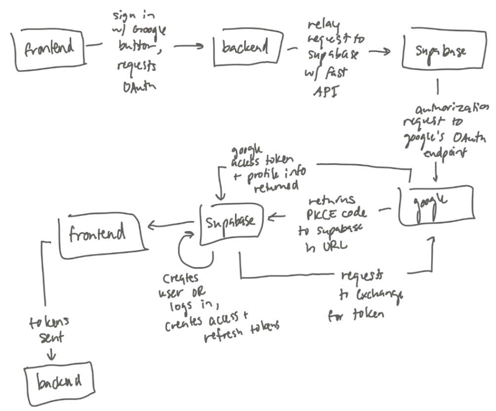

# Planning Directory
| Method | Pros | Cons |
|------|------|------|
| **Email + Password**  User signs up and logs in with email and password | - Familiar and simple for users to understand - Works without any third-party apps | - Users may forget passwords - Password security must be handled (Supabase handles hashing, storage, resets, etc.) |
| **Passwordless (Magic Link)**  User enters email, receives a link, and clicks it to log in | - No password to forget or steal | - Slower than typing a password - Can be cumbersome for users |
| **OAuth (Login through third-party service)**  Supabase supports many providers (e.g., Google, GitHub, Apple, Facebook, etc.)  Users click “Login with [provider]”; the provider confirms identity, Supabase trusts the provider, and the user is logged in | - Very fast login experience - No passwords to manage | - Depends on third-party services - Risk of account compromise at the provider level |
| **Two-Factor Authentication (Phone number + one-time code)**  User enters phone number, receives a one-time code, enters the code, and logs in | - No password required - Works well for mobile apps (users already on their phone) | - SMS delivery issues - Costs money at scale |
| **Enterprise / Custom SSO**  Used by companies and institutions to log in with organization-managed accounts | - One login for everything - IT departments handle account security - Admins can enable or revoke access instantly | - Requires company or institution-managed accounts - Smaller teams may not have SSO - Often behind a paywall |

**Sign Up + Log In token flows/overall overview:** 

**Chosen model and reasoning:** We chose OAuth login/signup because it is the simplest for users. 